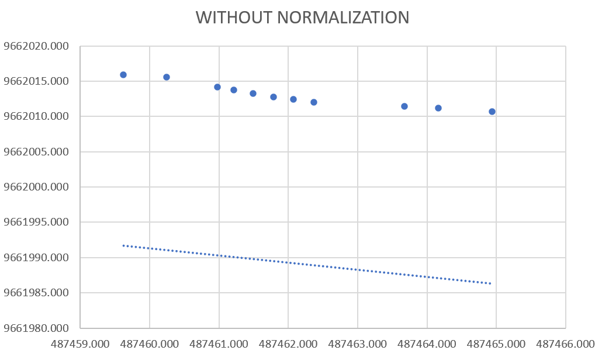
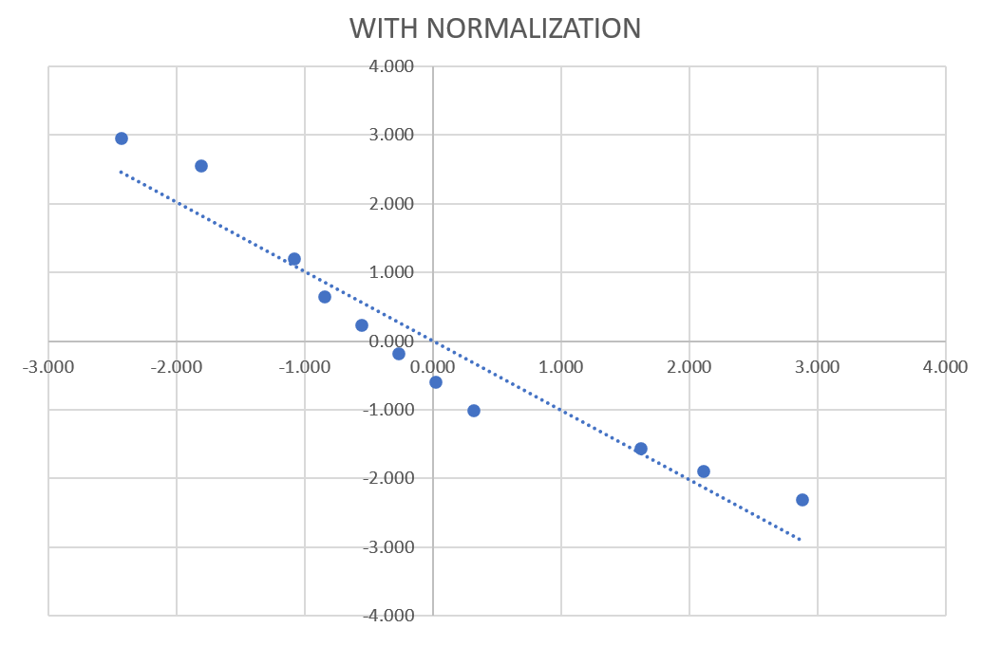
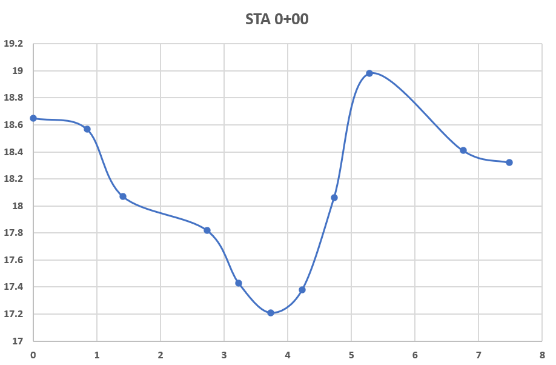

# cross-section

## What is this program about?
This repository contains cut and fill calculations for cross-section using Python programming language. 
It converts precision GPS data into cross-section data and later it is overlaid with designed cross-sections to get cut and fill calculations.

## Algorithms and concepts
Data scarcity in our country and limitations in high-quality surveying techniques, made us rely on precision GPS data to obtain topography data.

### Raw data
The raw data that is obtained is in the format of easting, northing and elevation (E, N, Z respectively).
E, N, Z data is (hopefully) taken in a straight line that is perpendicular to the long section of an open channel.
This is one of the sample data in UTM projection. 

|Name|Station|E (m)|N (m)|Z (m)|
| :----:   | :----:  | :----:   | :----:   | :----: |
|STA.0+00| 	A	|487464.944	|9662010.643	|18.650|
|STA.0+00|	A1	|487464.168	|9662011.063	|18.570|
|STA.0+00|	A2	|487463.685	|9662011.385	|18.070|
|STA.0+00|	T1	|487462.375	|9662011.944	|17.820|
|STA.0+00|	D1	|487462.085	|9662012.359	|17.430|
|STA.0+00|	D2	|487461.795	|9662012.775	|17.210|
|STA.0+00|	D3	|487461.505	|9662013.191	|17.380|
|STA.0+00|	T2	|487461.215	|9662013.606	|18.060|
|STA.0+00|	B1	|487460.982	|9662014.152	|18.980|
|STA.0+00|	B2	|487460.255	|9662015.507	|18.410|
|STA.0+00|	B	|487459.627	|9662015.906	|18.320|

### Regression and Normalization
Regression is done to estimate the most likely cross-section from survey data. 
Regression process is done with <a href = "https://scikit-learn.org/stable/modules/generated/sklearn.linear_model.LinearRegression.html"> sklearn.linear_model.LinearRegression</a> class in the <a href="https://scikit-learn.org/">scikit-learn</a> library.

Normalization is needed for the coordinates using UTM projection. Why?

The calculation of regression involving multiplication of each vector. As we know that in UTM actually the coordinates are very large numbers and the standard deviation is relatively small compared to the mean value.
Therefore to get best regression line we have to substract all N and E coordinates with some constants to get them near origin (could be minimum value, maximum value, mean, median, or something you can think of that is similar).

*N-E regression (plan view) without normalization*  

*N-E regression (plan view) with normalization*

### Cross-section results
After regression and normalization process, we get the most likely cross-section by bringing all the points to the regression line. The results is as follows:

Name | Station | Z | Delta X | Cumulative X
| :----:   | :----:  | :----:   | :----:   | :----: |
STA 0+00 | A | 18.65 | 0 | 0
STA 0+00 | A1 | 18.57 | 0.843661 | 0.843661
STA 0+00 | A2 | 18.07 | 0.568448 | 1.412109
STA 0+00 | T1 | 17.82 | 1.318539 | 2.730648
STA 0+00 | D1 | 17.43 | 0.499109 | 3.229757
STA 0+00 | D2 | 17.21 | 0.49982 | 3.729577
STA 0+00 | D3 | 17.38 | 0.499891 | 4.229468
STA 0+00 | T2 | 18.06 | 0.499109 | 4.728577
STA 0+00 | B1 | 18.98 | 0.551891 | 5.280468
STA 0+00 | B2 | 18.41 | 1.47487 | 6.755338
STA 0+00 | B | 18.32 | 0.724849 | 7.480187

 

 

*Sample cross-section output*

### Cut and fill calculations

### Automating tasks in AutoCAD

>_layer set GarisElevasiTanah 
PLINE 145.6291,350.637
146.47276100761383,350.557
147.0412087208462,350.057
148.35974774511246,349.807
148.85885669011958,349.41700000000003
149.35867703116548,349.197
149.8585676501334,349.367
150.35767659646564,350.047
150.90956764034553,350.96700000000004
152.38443766255025,350.39700000000005
153.10928660195157,350.307

## How to use?
1. Input file is given in the folder that has prefix "input".
  
2. Output file is given in the folder that has prefix "output".
  
3. Here are some steps to use this program:  

	3.1. You have to familiarize yourself with csv in input file. Parameters are given in Indonesian language.
  
		3.1.1. input = raw data from geodetic GPS, it contains of E, N, Z for each of station.  
		3.1.2. input_rencana = it gives the criteria of dimension and elevation where we plan the open channel.  
  		3.1.3. input_acad = it contains several parameters to draw the cross-section to AutoCAD application.  
  
	3.2.  Delete all the folder that has prefix "output".
  
	3.3.  Run main.bat to process input and produces existing cross-section based on GPS raw data.  
  
	3.4.  Run main2.bat to process cut and fill volume.  
  
	3.5.  Run main3.bat to make AutoCAD script.  
  
	3.6.  Drag .scr file from output_scr file to AutoCAD and you will get thousands of existing and planned cross-sections.  

## Sample output
